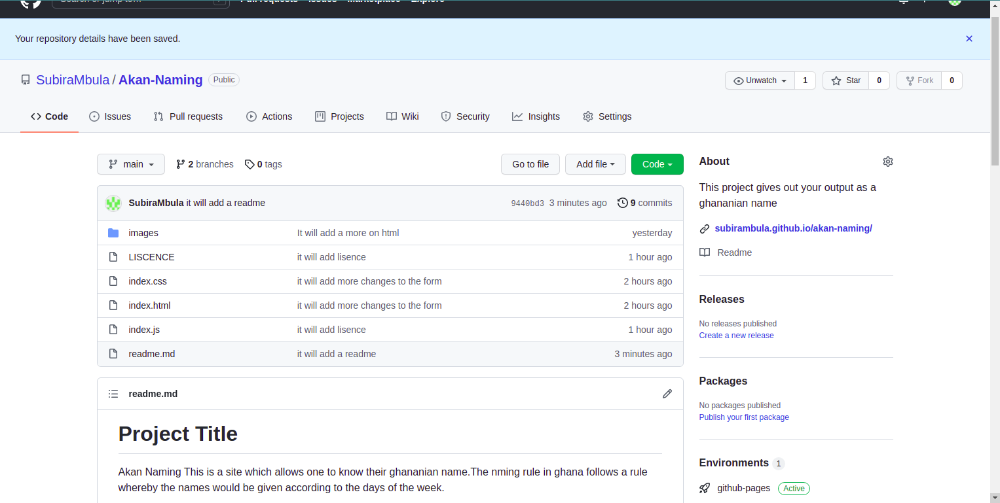

# Project Title

Akan Naming
This is a site which allows one to know their ghananian name.The nming rule in ghana follows a rule whereby the names would be given according to the days of the week.
## Built with;
1. HTML
2. CSS
3. JAVASCRIPT
## Getting Started

These instructions will give you a copy of the project up and running on
your local machine for development and testing purposes. 

### Prerequisites
. git 

    $sudo apt -install git
    $sudo apt -get update

### Installing
step 1

Clone the repo

    git clone https://github.com/SubiraMbula/Akan-Naming

And then initialize git in the terminal;

    git init 

## Running the tests
1. Click on the deployed link ;

2. ### The page will appear as below;

3. ### Read through the information;

3. ### Enter details that required;

4. ### Recieve your output as a akan name.

## Authors
Subira Mbula

## License

This project is licensed under the [MIT liscence](LICENSE.md)
License - see the [LICENSE.md](LICENSE.md) file for more
details
## Contact
1. Email- subira.savali@student.moringaschool.com
1. project link-https://github.com/SubiraMbula/Akan-Naming
## Aknowledgement
1. MIT open source lisence.
2. Git hub 
3. Google fonts
4. Gradient Backgrounds